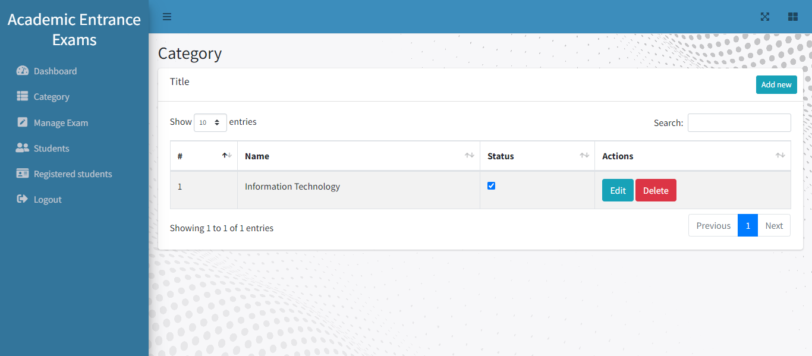

# Academic Entrance Exams

-   Application to manage and take the Entrance Exams Online.
-   Admin can create test, manage tests and students.
-   Students can apply for the test and view results and answer sheets.

# Testing

Check the following localhost project.

```
Admin login
email: shot@gmail.com
password : admin1234
```

```
Admin login
email: admin@gmail.com
password : password
```

Register Admin " http://127.0.0.1:8000/admin/register "

# Installation

1. **Clone or download this Repository.**
2. **Run the command**

    ```
    composer install
    ```

    if you get any problems while running above command then run the following command.

    ```
    composer install --ignore-platform-reqs
    ```

3. **Create `.env` file by copying the `.env.example`, or run the following command**

    ```
    cp .env.example .env
    ```

4. **Update the database name and credentials in `.env` file**

    ```
    DB_CONNECTION=mysql
    DB_HOST=127.0.0.1
    DB_PORT=3306
    DB_DATABASE="Your database name"
    DB_USERNAME="your database username"
    DB_PASSWORD="your database password"

     for localhost testing

    DB_CONNECTION=mysql
    DB_HOST=127.0.0.1
    DB_PORT=3306
    DB_DATABASE=exam_application
    DB_USERNAME=root
    DB_PASSWORD=
    ```

5. **Run the following command**
    ```
    php artisan migrate --seed
    ```
6. **Run npm command**
    ```
    npm install
    ```
7. **Run the command to compile the theme**
    ```
    npm run dev
    ```
8. **Finally run the application**
    ```
    php artisan serve
    ```

# Screenshots

## Landing page


## Admin side





## Student side


